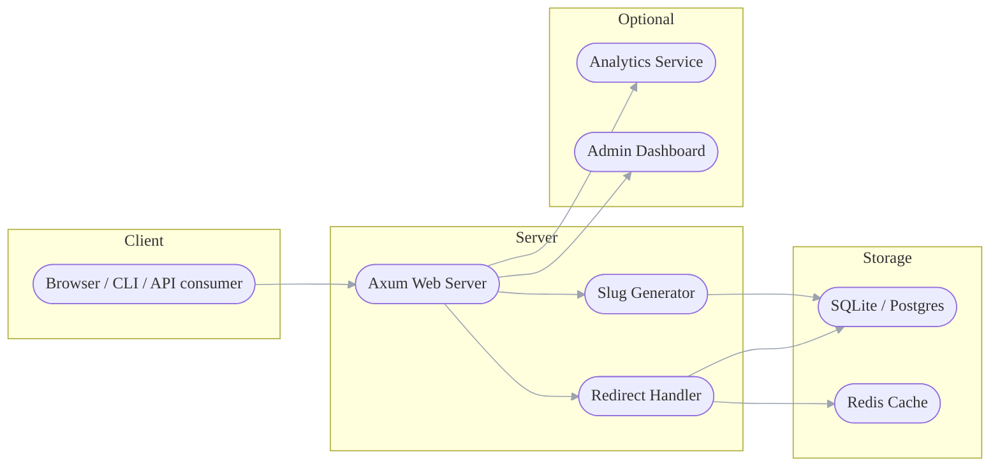

# rust-url-shortener

## Description

<b>rust-url-shortener</b> is a lightweight application for url shortener. Written in <b>Rust</b>.

## Quick glossary
* <b>Slug / short code</b>: the short identifier in the short URL (e.g. abc123 in https://sho.rt/abc123).
* <b>Redirect</b>: HTTP response that sends the browser to the long target URL. Usually 301 (permanent) or 302/307 (temporary).
* <b>Collision</b>: when two different long URLs map to the same slug.
* <b>Base62</b>: alphabet 0-9a-zA-Z used commonly to encode numbers into short strings.
* <b>Hash / fingerprint</b>: deterministic digest (e.g., SHA-256) of a URL. Can be base-encoded to create slugs.
* <b>Custom alias</b>: user-provided slug instead of an auto-generated one.
* <b>Rate limiting</b>: preventing abuse (e.g., throttle create requests).
* <b>CDN / edge redirect</b>: performing redirects at edge nodes for performance (e.g., Cloudflare Workers).
* <b>Atomic counter</b>: a monotonic integer used to generate sequential slugs (encoded in base62).
* <b>Cache</b>: e.g., Redis cache for slug→target to speed redirects.
* <b>Analytics</b>: counts/metadata about clicks (IP, UA, time).
* <b>Normalization</b>: canonicalizing target URLs (add https://, remove trailing slash, etc).
* <b>Open redirect</b>: a vulnerability where your site can redirect to arbitrary locations. Validate target to avoid abuse.
* <b>Idempotency</b>: repeated identical shorten requests could return the same slug (if you choose to dedupe).

## Endpoints
* `POST /api/v1/shorten`
* `GET /api/v1/{slug}`
* `GET /api/v1/info/{slug}`
* `DELETE /api/v1/{slug}`

## Data flow

